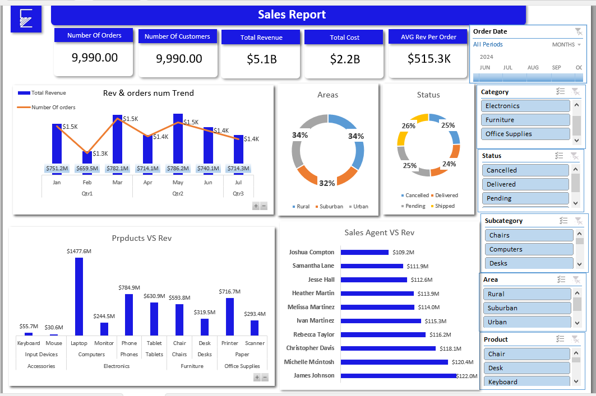

# Excel Sales Dashboard Project 📊

## Project Overview
This project demonstrates an end-to-end Excel data analysis workflow:
- **Data Cleaning** using **Power Query**
- **Data Modeling** with **Power Pivot**
- **DAX Measures** for KPIs
- **PivotTables & Charts** for visualization

## Key Insights
- Total Revenue: $5.1B  
- Total Orders: 9,990  
- Top-performing product: Laptops ($1477.6M revenue)  
- Customer distribution: Electronics category leads with 8,357 customers
- Top performing agent: James Johnson with $122M revenue

## Dashboard

## Files
- `Sales_Report_Project.xlsx`: Full Excel file (Power Query, Data Model, PivotTables, Dashboard)
- `sales_analysis_1.png & sales_analysis_2.png & sales_analysis_3.png`: Dashboard screenshot

## Tools Used
- Excel (Power Query, Power Pivot, DAX, PivotTables, Charts)

---
📌 This project showcases my ability to clean, model, and analyze data in Excel, delivering business insights through interactive dashboards.
